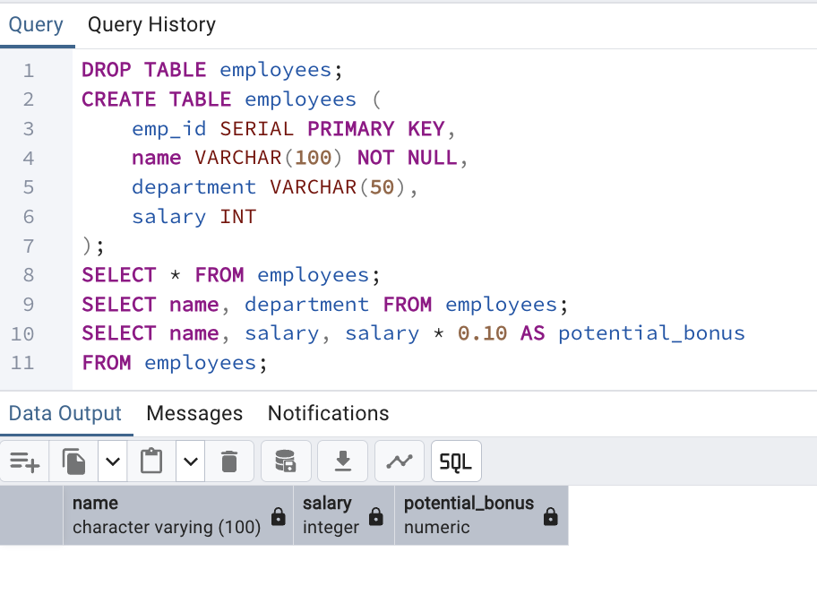
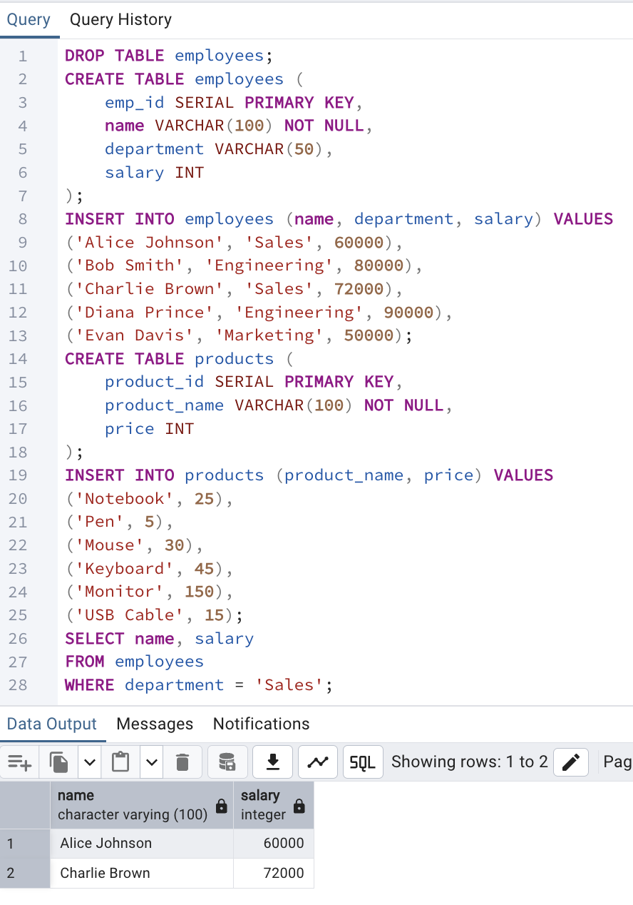
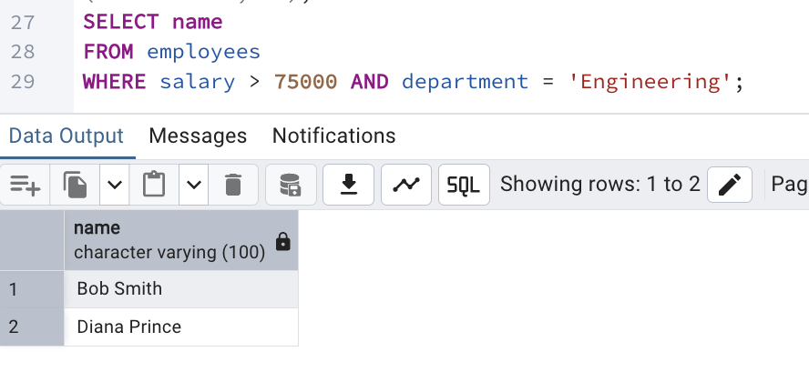
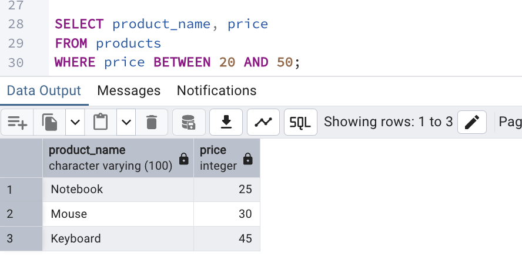

SELECT statements

WHERE clause conditions



Pattern matching (LIKE, ILIKE)
```sql
DROP TABLE IF EXISTS customers;
CREATE TABLE customers (
    customer_id SERIAL PRIMARY KEY,
    customer_name VARCHAR(100) NOT NULL
);
INSERT INTO customers (customer_name) VALUES
('Brad Pitt'),
('Brandon Lee'),
('Alice Johnson'),
('Brian Cox'),
('Brittany Spears');
DROP TABLE products;
CREATE TABLE products (
    product_id SERIAL PRIMARY KEY,
    product_name VARCHAR(100) NOT NULL
);
INSERT INTO products (product_name) VALUES
('Strawberry'),
('Blueberry'),
('Blackberry'),
('Apple'),
('Banana');
DROP TABLE IF EXISTS users;
CREATE TABLE users (
    user_id SERIAL PRIMARY KEY,
    email VARCHAR(100) NOT NULL
);
INSERT INTO users (email) VALUES
('john.doe@gmail.com'),
('alice@yahoo.com'),
('brad.pitt@gmail.com'),
('user123@outlook.com'),
('brandon.lee@GMAIL.com');

SELECT customer_name
FROM customers
WHERE customer_name LIKE 'Bra%';
```

```sql
SELECT product_name
FROM products
WHERE product_name LIKE '%berry';
```

```sql
SELECT email
FROM users
WHERE email ILIKE '%@gmail.com';
```

Regular expressions
```sql
DROP TABLE IF EXISTS employees;
CREATE TABLE employees (
    emp_id SERIAL PRIMARY KEY,
    name VARCHAR(100) NOT NULL,
    department VARCHAR(50),
    salary INT
);

INSERT INTO employees (name, department, salary) VALUES
('Alice Johnson', 'Sales', 60000),
('Bob Smith', 'Engineering', 80000),
('Charlie Brown', 'Sales', 72000),
('Diana Prince', 'Engineering', 90000),
('Evan Davis', 'Marketing', 50000),
('Andrew Blake', 'Sales', 65000),
('Barbara White', 'HR', 55000);

DROP TABLE IF EXISTS users;
CREATE TABLE users (
    user_id SERIAL PRIMARY KEY,
    email VARCHAR(100) NOT NULL
);

INSERT INTO users (email) VALUES
('john.doe@gmail.com'),
('alice@yahoo.com'),
('brad.pitt@gmail.com'),
('user123@outlook.com'),
('brandon.lee@gmail.com'),
('invalid-email.com'),
('test@site');

SELECT name
FROM employees
WHERE name ~ '^[AB]';
```

```sql
SELECT email
FROM users
WHERE email ~* '^[A-Z0-9._%+-]+@[A-Z0-9.-]+\.[A-Z]{2,}$';
```


