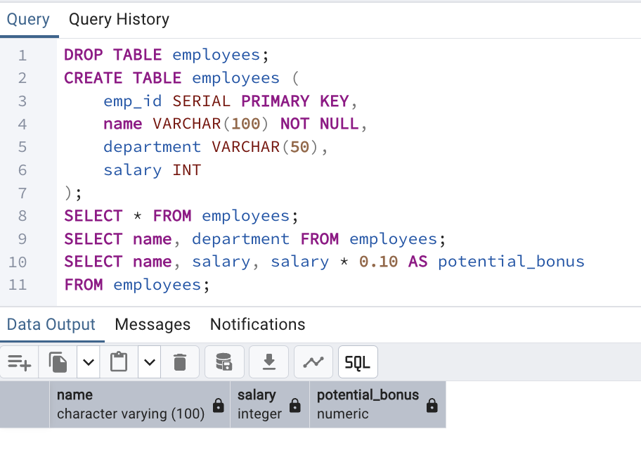
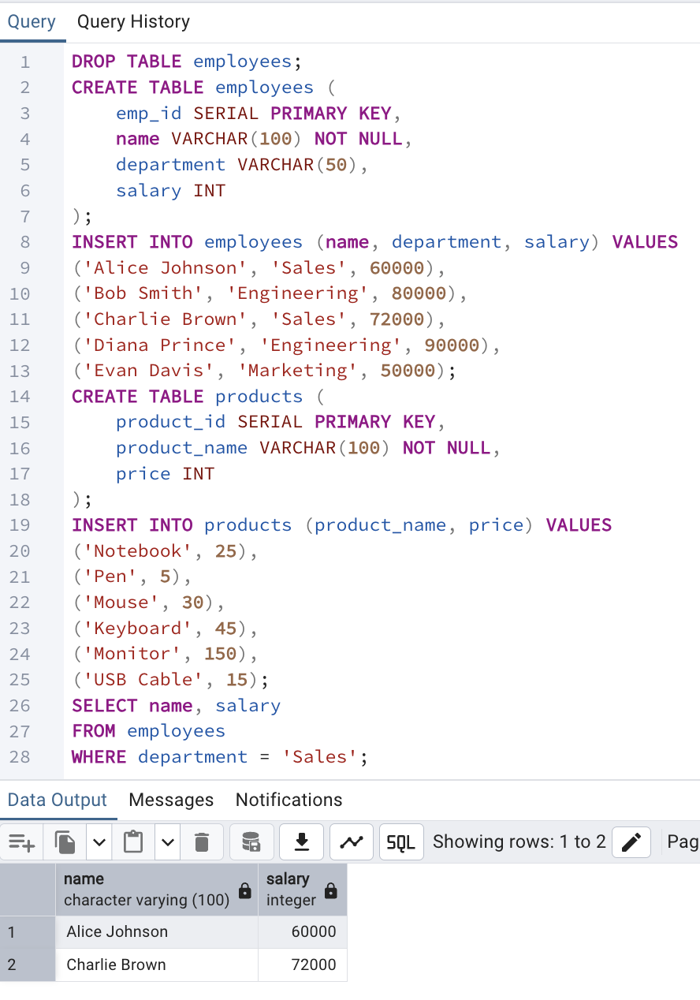
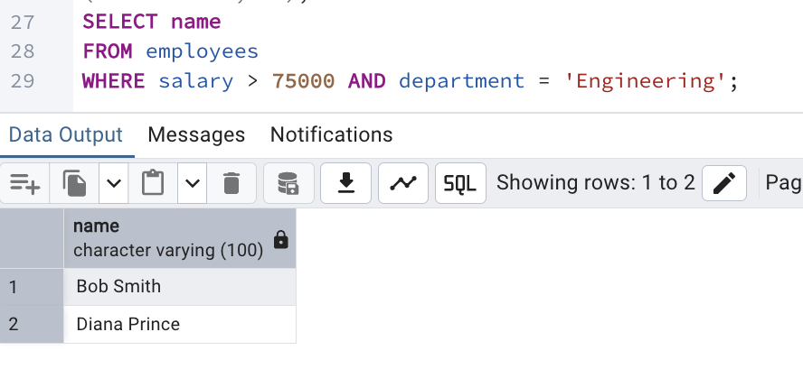
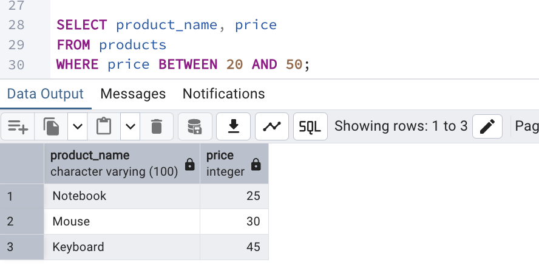

SELECT statements

WHERE clause conditions



Pattern matching (LIKE, ILIKE)
```sql
DROP TABLE IF EXISTS customers;
CREATE TABLE customers (
    customer_id SERIAL PRIMARY KEY,
    customer_name VARCHAR(100) NOT NULL
);
INSERT INTO customers (customer_name) VALUES
('Brad Pitt'),
('Brandon Lee'),
('Alice Johnson'),
('Brian Cox'),
('Brittany Spears');
DROP TABLE products;
CREATE TABLE products (
    product_id SERIAL PRIMARY KEY,
    product_name VARCHAR(100) NOT NULL
);
INSERT INTO products (product_name) VALUES
('Strawberry'),
('Blueberry'),
('Blackberry'),
('Apple'),
('Banana');
DROP TABLE IF EXISTS users;
CREATE TABLE users (
    user_id SERIAL PRIMARY KEY,
    email VARCHAR(100) NOT NULL
);
INSERT INTO users (email) VALUES
('john.doe@gmail.com'),
('alice@yahoo.com'),
('brad.pitt@gmail.com'),
('user123@outlook.com'),
('brandon.lee@GMAIL.com');

SELECT customer_name
FROM customers
WHERE customer_name LIKE 'Bra%';
```
```csv
"customer_name"
"Brad Pitt"
"Brandon Lee"
```
```sql
SELECT product_name
FROM products
WHERE product_name LIKE '%berry';
```
```csv
"product_name"
"Strawberry"
"Blueberry"
"Blackberry"
```
```sql
SELECT email
FROM users
WHERE email ILIKE '%@gmail.com';
```
```csv
"email"
"john.doe@gmail.com"
"brad.pitt@gmail.com"
"brandon.lee@GMAIL.com"
```
Regular expressions
```sql
DROP TABLE IF EXISTS employees;
CREATE TABLE employees (
    emp_id SERIAL PRIMARY KEY,
    name VARCHAR(100) NOT NULL,
    department VARCHAR(50),
    salary INT
);

INSERT INTO employees (name, department, salary) VALUES
('Alice Johnson', 'Sales', 60000),
('Bob Smith', 'Engineering', 80000),
('Charlie Brown', 'Sales', 72000),
('Diana Prince', 'Engineering', 90000),
('Evan Davis', 'Marketing', 50000),
('Andrew Blake', 'Sales', 65000),
('Barbara White', 'HR', 55000);

DROP TABLE IF EXISTS users;
CREATE TABLE users (
    user_id SERIAL PRIMARY KEY,
    email VARCHAR(100) NOT NULL
);

INSERT INTO users (email) VALUES
('john.doe@gmail.com'),
('alice@yahoo.com'),
('brad.pitt@gmail.com'),
('user123@outlook.com'),
('brandon.lee@gmail.com'),
('invalid-email.com'),
('test@site');

SELECT name
FROM employees
WHERE name ~ '^[AB]';
```
```csv
"name"
"Alice Johnson"
"Bob Smith"
"Andrew Blake"
"Barbara White"
```
```sql
SELECT email
FROM users
WHERE email ~* '^[A-Z0-9._%+-]+@[A-Z0-9.-]+\.[A-Z]{2,}$';
```
```csv
"email"
"john.doe@gmail.com"
"alice@yahoo.com"
"brad.pitt@gmail.com"
"user123@outlook.com"
"brandon.lee@gmail.com"
```
IN and EXISTS operators
```sql
DROP TABLE IF EXISTS employees;
CREATE TABLE employees (
    emp_id SERIAL PRIMARY KEY,
    name VARCHAR(100) NOT NULL,
    department_id INT,
    salary INT
);

INSERT INTO employees (name, department_id, salary) VALUES
('Alice Johnson', 1, 60000),
('Bob Smith', 3, 80000),
('Charlie Brown', 5, 72000),
('Diana Prince', 7, 90000),
('Evan Davis', 3, 50000);

DROP TABLE IF EXISTS sales;
CREATE TABLE sales (
    sale_id SERIAL PRIMARY KEY,
    employee_id INT,
    amount INT
);

INSERT INTO sales (employee_id, amount) VALUES
(2, 1200),
(3, 800),
(4, 1500),
(5, 500);

SELECT name, department_id
FROM employees
WHERE department_id IN (3, 5, 7);
```
```csv
"name"	"department_id"
"Bob Smith"	3
"Charlie Brown"	5
"Diana Prince"	7
"Evan Davis"	3
```
```sql
SELECT name
FROM employees
WHERE emp_id IN (
    SELECT employee_id
    FROM sales
    WHERE amount > 1000
);
```
```csv
"name"
"Bob Smith"
"Diana Prince"
```
```sql
SELECT name
FROM employees e
WHERE EXISTS (
    SELECT 1
    FROM sales s
    WHERE s.employee_id = e.emp_id AND s.amount > 1000
);
```
```csv
"name"
"Bob Smith"
"Diana Prince"
```
CASE statements
```sql
DROP TABLE IF EXISTS employees;
CREATE TABLE employees (
    emp_id SERIAL PRIMARY KEY,
    name VARCHAR(100) NOT NULL,
    salary INT
);
INSERT INTO employees (name, salary) VALUES
('Alice Johnson', 120000),
('Bob Smith', 80000),
('Charlie Brown', 50000),
('Diana Prince', 95000),
('Evan Davis', 45000);

SELECT name, salary,
  CASE
    WHEN salary > 100000 THEN 'Senior'
    WHEN salary BETWEEN 60000 AND 100000 THEN 'Mid-Level'
    ELSE 'Junior'
  END AS employee_level
FROM employees;
```
```csv
"name"          "salary"    "employee_level"
"Alice Johnson" 120000      "Senior"
"Bob Smith"     80000       "Mid-Level"
"Charlie Brown" 50000       "Junior"
"Diana Prince"  95000       "Mid-Level"
"Evan Davis"    45000       "Junior"
```
Common Table Expressions (CTEs)

```sql
DROP TABLE IF EXISTS employees;
CREATE TABLE employees (
    emp_id SERIAL PRIMARY KEY,
    name VARCHAR(100) NOT NULL,
    department VARCHAR(50),
    salary INT
);

INSERT INTO employees (name, department, salary) VALUES
('Alice Johnson', 'Sales', 60000),
('Bob Smith', 'Engineering', 80000),
('Charlie Brown', 'Sales', 72000),
('Diana Prince', 'Engineering', 90000),
('Evan Davis', 'Marketing', 50000),
('Fiona White', 'Marketing', 55000),
('George Black', 'Sales', 65000);

WITH department_averages AS (
  SELECT
    department,
    AVG(salary) AS avg_salary
  FROM employees
  GROUP BY department
)

SELECT
  e.name,
  e.salary,
  e.department,
  da.avg_salary
FROM employees e
JOIN department_averages da ON e.department = da.department
WHERE e.salary > da.avg_salary;
```
```csv
"name"           ,"salary" ,"department" ,"avg_salary"
"Charlie Brown"  ,72000   ,"Sales"      ,65666.666666666667
"Diana Prince"   ,90000   ,"Engineering",85000.000000000000
"Fiona White"    ,55000   ,"Marketing"  ,52500.000000000000
```